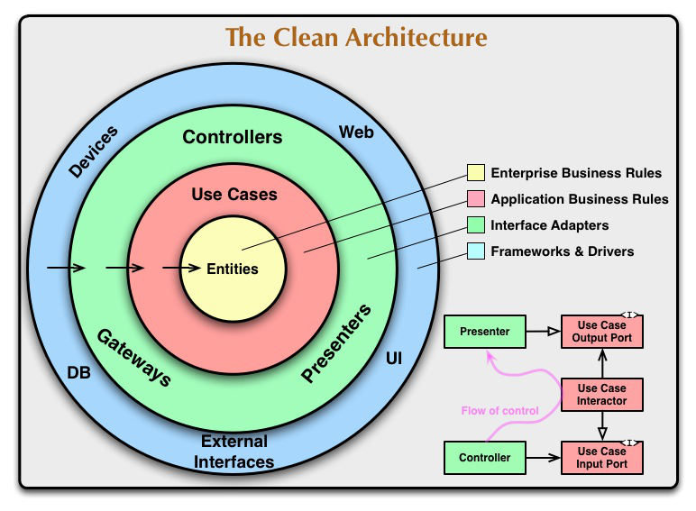

# VOTE ITEMS

This is the repository for the Vote items application.

You can find my written about the design of this application on my [Medium](https://medium.com/@kritwis/golang-clean-architecture-with-demo-e0938e5be02b).

To run this code, you will need docker and docker-compose installed on your machine. In the project root, run `docker-compose up`.

Hopefully I get this job, eh!